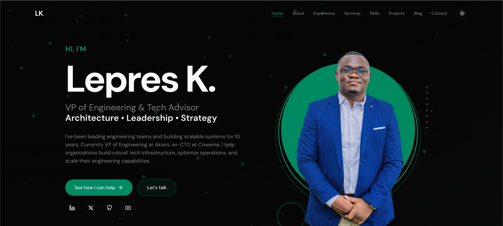

# lepresk.com



Personal portfolio and technical blog, live at [lepresk.com](https://lepresk.com).

Built with Laravel 12 and Filament 4. Articles are written in English in the admin panel and can be translated into French with Claude from the same interface.

## Features

### Bilingual content

- Translatable title, slug, excerpt, content and SEO metadata (`spatie/laravel-translatable`, JSON columns)
- Language resolved from the `?lang=` parameter, then the `locale` cookie, then the `Accept-Language` header
- No language prefix in URLs. An article answers to both its English and its French slug
- Falls back to the default language when a translation is missing

### AI translation

An admin action translates an article into French, and a second one regenerates an existing translation. Two `laravel/ai` agents run on `claude-sonnet-5`: one for the markdown body, one for the short fields and the French slug.

Validation is applied in PHP before anything is saved:

- Image URLs from the source must all be present in the translation
- The ratio of accented letters must be consistent with French text
- Em dashes, curly quotes and non-breaking spaces are replaced with plain equivalents
- Slugs are limited to 60 characters, cut on a word boundary, and checked for uniqueness across languages
- Regenerating a translation keeps the existing French slug so published URLs do not change

### Blog

- Markdown content with syntax highlighting (Prism)
- Read time computed from the content at 200 words per minute when left empty
- Categories and tags
- Draft preview through a signed URL

### Portfolio

- Projects with categories, tags and a featured image
- Image gallery with a lightbox: keyboard navigation, touch swipe, counter, scroll lock, focus restore

### Admin panel

- Filament 4, protected by authentication
- Language switcher on list, create and edit pages
- Translation and cache flush actions

### Caching

Rendered HTML is cached server side with the language in the cache key. `App\Cache\BlogCache` builds every key. Invalidation runs on create, update, translate, delete, restore and force delete, for each slug in each language.

Browser caching is disabled on blog pages because both languages are served from the same URL and the host strips the `Vary` header.

### SEO

- `canonical` and `hreflang` per article, limited to existing translations
- XML sitemap with one entry per translated slug
- Open Graph and Twitter Card metadata
- `BlogPosting` structured data
- Custom 404, 419 and 500 pages

## Requirements

- PHP 8.4
- Node 24
- Composer and pnpm
- SQLite for local development, MariaDB in production

## Installation

```bash
composer install
pnpm install
cp .env.example .env
php artisan key:generate
touch database/database.sqlite
php artisan migrate
php artisan storage:link
composer run dev
```

Set `ANTHROPIC_API_KEY` in `.env` to enable the translation actions. The rest of the site works without it.

## Testing

```bash
php artisan test                        # feature and unit tests
php artisan test --testsuite=Browser    # requires npx playwright install
vendor/bin/pint --dirty                 # code style
vendor/bin/phpstan analyse --memory-limit=2G
```

AI agents are faked in the test suite. `preventStrayPrompts()` ensures no test performs a network call.

## Tech stack

| Layer | Tools |
| --- | --- |
| Backend | PHP 8.4, Laravel 12, Filament 4 |
| Frontend | Blade, Tailwind 4, Vite 7, vanilla JavaScript |
| AI | `laravel/ai`, Claude Sonnet 5 |
| Database | MariaDB in production, SQLite in tests |
| Quality | Pest 4, Larastan (PHPStan level max), Pint, Rector |

## Deployment

Pushing to `main` triggers a GitHub Actions workflow that:

1. Builds the assets on the runner
2. Rsyncs the source and compiled assets to the server
3. Runs `composer install`, migrations and optimization commands

Assets are built on the runner rather than on the shared host, where esbuild runs out of memory.

## License

© 2026 Lepres Kikounga. All rights reserved.
