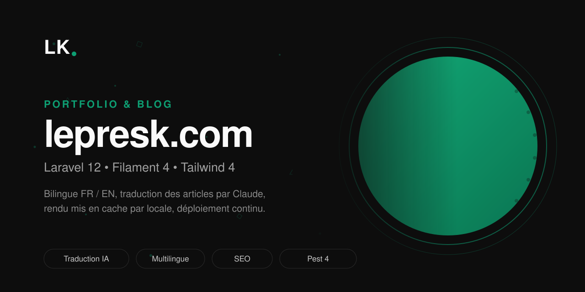

<p align="center">
  
</p>

<p align="center">
  Portfolio et blog de Lepres Kikounga, en ligne sur <a href="https://lepresk.com">lepresk.com</a>.
</p>

---

Site bilingue construit sur Laravel 12 et Filament 4. Les articles sont rédigés en anglais dans l'admin, puis traduits en français par Claude depuis cette même interface, sans quitter le back-office.

## Fonctionnalités

### Blog bilingue, une seule URL par article

Titre, slug, extrait, contenu et métadonnées SEO sont traduisibles (`spatie/laravel-translatable`, colonnes JSON). La langue affichée vient du paramètre `?lang=`, à défaut du cookie, à défaut de l'en-tête `Accept-Language` — le schéma d'URL reste `/blog/{slug}`, sans préfixe de langue. Un article demandé par son slug anglais ou français répond dans les deux cas, avec repli sur la langue par défaut quand une traduction manque.

### Traduction automatique EN vers FR

Une action dans l'admin génère la version française d'un article, et une seconde permet de la regénérer. Deux agents `laravel/ai` sont appelés sur `claude-sonnet-5` : l'un traduit le corps markdown, l'autre renvoie en un seul appel structuré les champs courts et un slug français court.

Ce que la traduction garantit, en PHP et non par confiance dans le modèle :

- **les images survivent** — les URLs de la source sont comparées à celles reçues, et l'article n'est pas modifié si l'une manque
- **le français est accentué** — un texte dont le taux de lettres accentuées s'effondre est refusé, pas publié
- **la typographie reste sobre** — tirets cadratins, guillemets courbes et espaces insécables sont remplacés par leurs équivalents simples
- **le slug reste court et lisible** — élisions supprimées, 60 caractères maximum coupés sur une frontière de mot, unicité vérifiée sur toutes les langues
- **l'URL publiée ne bouge pas** — une regénération conserve le slug français existant

Les instructions du traducteur portent le point de rupture du cache de prompt, l'article variant à chaque appel.

### Temps de lecture calculé

Laissé vide, il est déduit du contenu à 200 mots par minute, et recalculé quand le contenu change tant que la valeur n'a pas été saisie à la main.

### Portfolio

Projets avec galerie d'images, ouverte en lightbox plein écran : navigation clavier, swipe tactile, compteur, verrouillage du défilement et focus restauré à la fermeture. Aucune dépendance JavaScript ajoutée.

### Administration Filament

Panneau protégé pour les articles, les projets, les catégories et les tags. Sélecteur de langue sur les pages de liste, de création et d'édition. Prévisualisation d'un brouillon par URL signée, purge du cache, actions de traduction.

### Cache

Le HTML rendu est mis en cache côté serveur avec la langue dans la clé, ce qui évite de rejouer le parsing markdown à chaque visite. `App\Cache\BlogCache` est le seul endroit qui construit ces clés, et l'invalidation couvre la création, la modification, la traduction, la suppression, la restauration et la suppression définitive, pour chaque slug de chaque langue.

Les pages ne sont pas mises en cache côté navigateur : les deux langues répondent sur la même URL et l'hébergeur retire l'en-tête `Vary`.

### SEO

`canonical` et `hreflang` par article, alternates limités aux traductions qui existent réellement, sitemap XML par langue, Open Graph et Twitter Card, données structurées `BlogPosting`. Pages 404, 419 et 500 aux couleurs du site.

## Stack

| | |
|---|---|
| Back | PHP 8.4, Laravel 12, Filament 4 |
| Front | Blade, Tailwind 4, Vite 7, JavaScript sans framework |
| IA | `laravel/ai` sur Claude Sonnet 5 |
| Base | MariaDB en production, SQLite en test |
| Qualité | Pest 4, PHPStan `level: max` via Larastan, Pint, Rector |

## Développement

```bash
composer install
pnpm install
cp .env.example .env && php artisan key:generate
php artisan migrate
php artisan storage:link
composer run dev
```

`ANTHROPIC_API_KEY` est nécessaire pour les actions de traduction, pas pour le reste du site.

## Tests

```bash
php artisan test              # 77 tests
php artisan test --testsuite=Browser   # Playwright, exige npx playwright install
vendor/bin/pint --dirty
vendor/bin/phpstan analyse --memory-limit=2G
```

Les agents IA sont simulés dans la suite : `preventStrayPrompts()` garantit qu'aucun test ne part sur le réseau.

## Déploiement

Poussé sur `main`, GitHub Actions compile les assets sur le runner, rsynce la source et les assets compilés vers l'hébergement mutualisé, puis exécute les migrations et les commandes d'optimisation. Les assets ne sont pas compilés sur le serveur : esbuild y consomme assez de mémoire pour s'y faire tuer, et un build interrompu laissait le site sans manifeste Vite.

## Licence

© 2026 Lepres Kikounga. Tous droits réservés.
